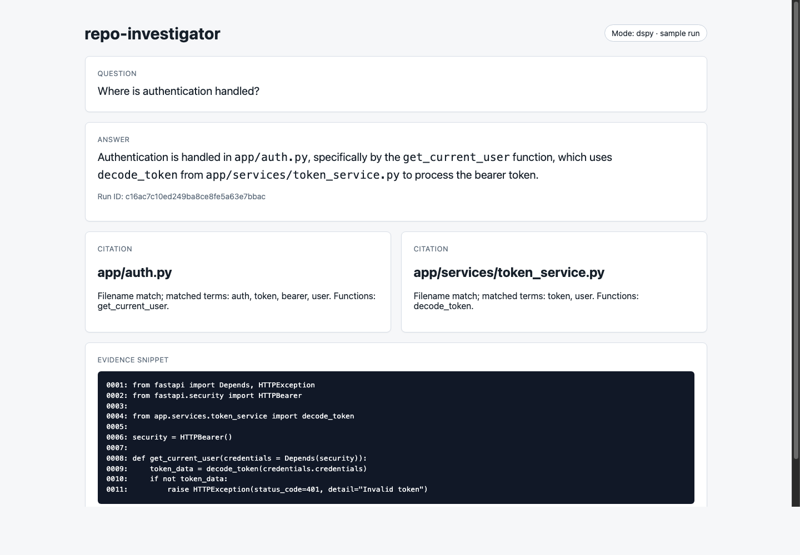
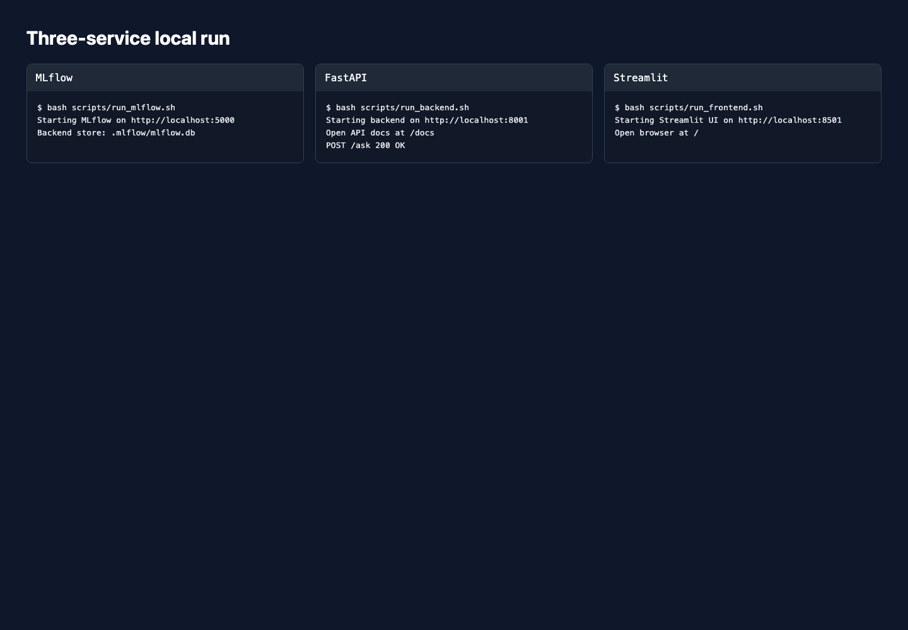
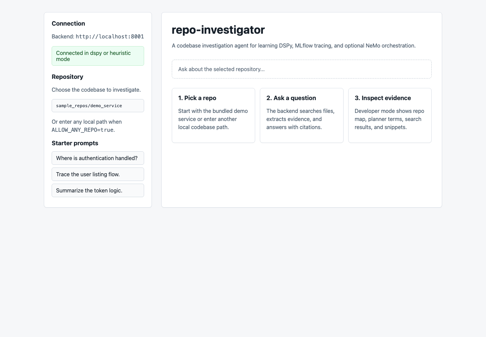
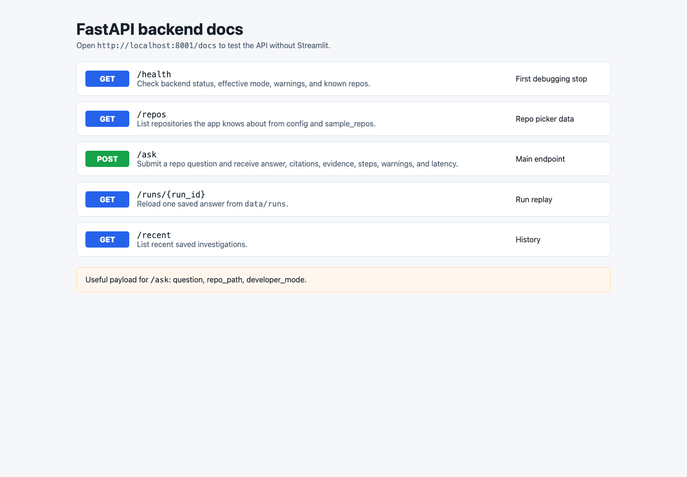
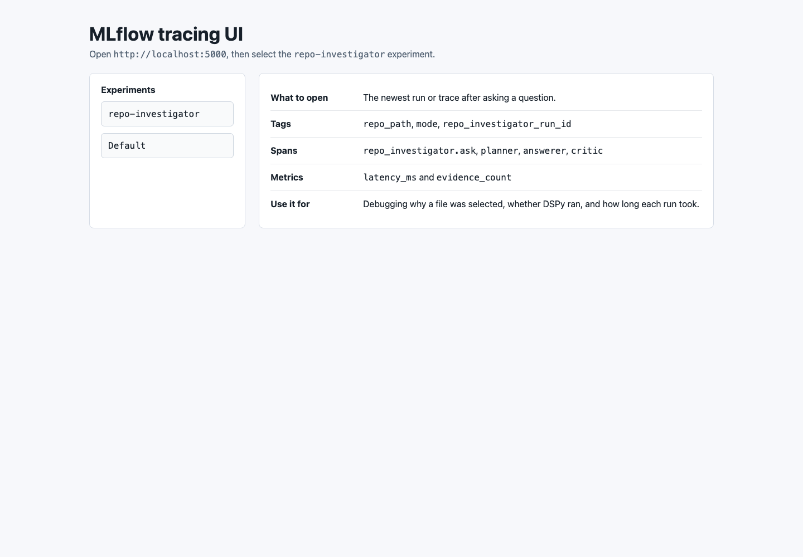
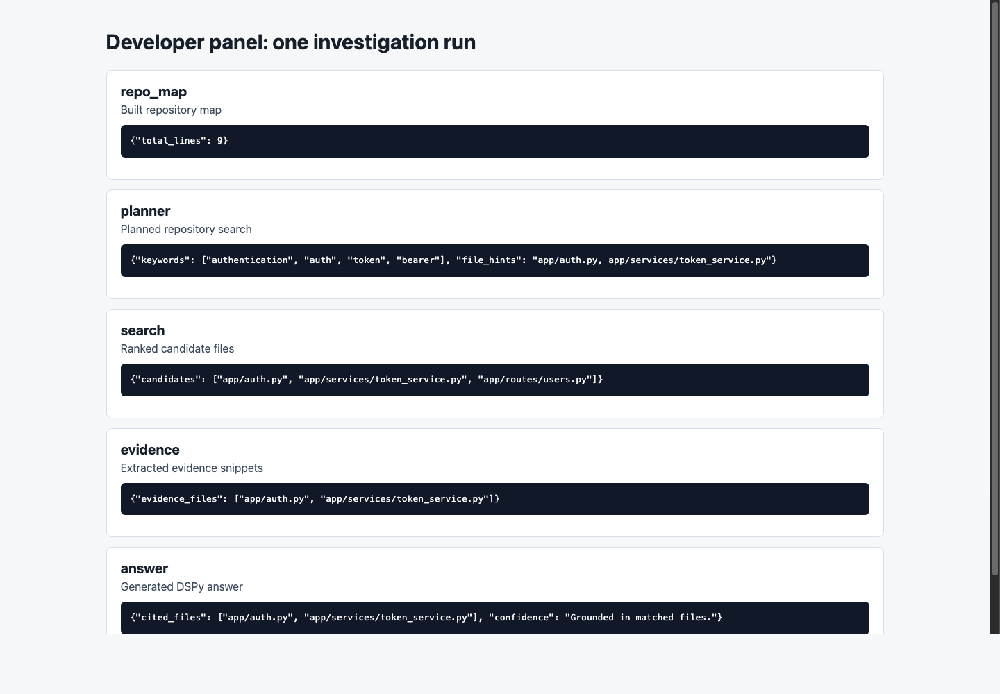
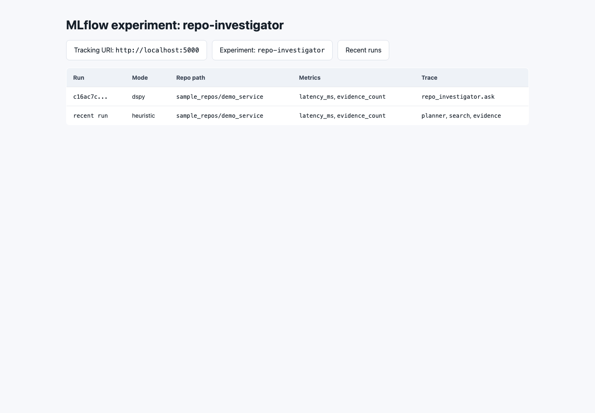
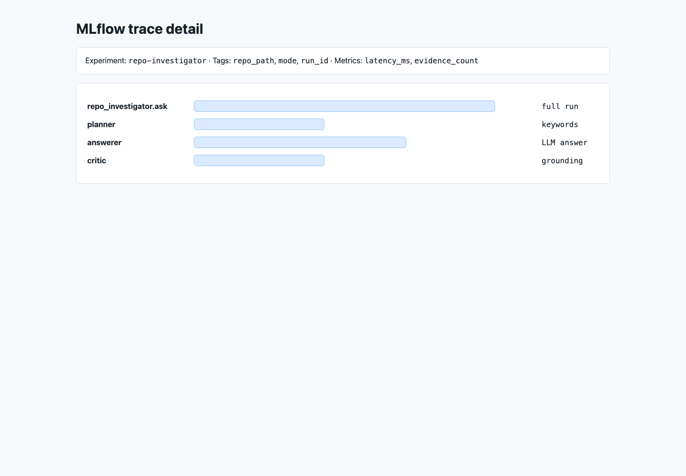

# repo-investigator

`repo-investigator` is a local codebase investigation app. Pick a repository, ask a question about the code, and get an answer backed by file citations, evidence snippets, and traceable execution steps.

The project is built to show how an LLM-backed developer tool can stay grounded in source code instead of returning an unsupported answer. It combines repo search, structured answer generation, a web UI, API endpoints, saved runs, and MLflow tracing.



## What It Does

You can ask questions such as:

- "Where is authentication handled?"
- "Trace the login flow."
- "Which files would likely change to add rate limiting?"
- "Summarize how the user routes work."

For each question, the app returns:

- a direct answer
- cited files
- evidence snippets from the repository
- step-by-step developer diagnostics
- a `run_id` that can be used to reload the saved result
- MLflow traces and metrics for debugging the pipeline

## Why This Project Matters

Most simple code assistants jump straight from a question to an answer. This project adds the missing engineering pieces around that flow:

- it searches the selected repository before answering
- it shows the evidence used for the answer
- it records the intermediate steps
- it supports an LLM path and a deterministic fallback path
- it exposes the same capability through both a UI and an API
- it traces runs so failures and weak answers can be inspected later

## Tech Stack

| Area | Technology | Purpose |
| --- | --- | --- |
| Frontend | Streamlit | Browser UI for selecting a repo, asking questions, and reviewing evidence |
| Backend | FastAPI + Uvicorn | API server for health checks, repo listing, questions, saved runs, and recent history |
| Agent layer | DSPy | Structured LLM programs for planning, answering, and critique |
| Fallback mode | Local heuristic search | Lets the project run without an LLM while still demonstrating the repo-search pipeline |
| Observability | MLflow | Traces, spans, metrics, tags, and debugging history |
| Validation | Pydantic | Request and response schemas |
| Configuration | `.env` + python-dotenv | Runtime settings for ports, LLM provider, repo access, and tracing |
| Optional orchestration | NeMo Agent Toolkit | Experimental wrapper around the backend capability |

## Architecture

```text
Streamlit UI
    |
    | POST /ask
    v
FastAPI backend
    |
    v
RepoInvestigatorService
    |
    |-- repo map
    |-- planner keywords
    |-- file search
    |-- evidence extraction
    |-- DSPy answer or heuristic answer
    |-- citations
    |-- saved run JSON
    |-- MLflow traces and metrics
```

Main files:

- `frontend/streamlit_app.py`: user interface
- `backend/app/main.py`: FastAPI routes
- `backend/app/agent.py`: investigation workflow
- `backend/app/repo_tools.py`: local file search, snippets, and Python AST summaries
- `backend/app/dspy_programs.py`: DSPy planner, answerer, and critic
- `backend/app/tracing.py`: MLflow setup and span helpers
- `backend/app/run_store.py`: saved run JSON files

## Run Locally

### 1. Install

```bash
cd repo-investigator
python -m venv .venv
source .venv/bin/activate
pip install -r requirements.txt
cp .env.example .env
```

The default `.env` is set up for:

- Streamlit: `http://localhost:8501`
- FastAPI: `http://localhost:8001`
- MLflow: `http://localhost:5000`
- Ollama: `http://localhost:11434`
- default repo: `sample_repos/demo_service`

If your `.env` uses a different `MLFLOW_TRACKING_URI`, open that port instead of `5000`.

### 2. Optional: start a local model

The default LLM path uses Ollama:

```bash
ollama run llama3.2:3b
```

The app can also run without a model by setting:

```env
AGENT_MODE=heuristic
```

Heuristic mode is useful for demos because repo search, citations, evidence extraction, saved runs, and tracing still work.

### 3. Start the services

Start all services together:

```bash
bash scripts/run_all.sh
```

For clearer logs, use three terminals:

```bash
bash scripts/run_mlflow.sh
```

```bash
bash scripts/run_backend.sh
```

```bash
bash scripts/run_frontend.sh
```



## Open The App

### Streamlit UI

Open `http://localhost:8501`.

Use this screen to choose a repository, ask questions, and inspect the answer.



The default codebase is the bundled demo service:

```text
sample_repos/demo_service
```

You can also investigate another local repository by entering its path in the sidebar. This is enabled by:

```env
ALLOW_ANY_REPO=true
```

To restrict access, set `ALLOW_ANY_REPO=false` and configure `ALLOWED_REPO_ROOTS`.

### FastAPI Docs

Open `http://localhost:8001/docs`.

This exposes the same functionality without the Streamlit UI. The main endpoint is `POST /ask`.



Useful endpoints:

- `GET /health`: backend status, active mode, warnings, default repo, and known repos
- `GET /repos`: repositories available to the UI
- `POST /ask`: run an investigation
- `GET /runs/{run_id}`: reload a saved answer
- `GET /recent`: list recent saved runs

### MLflow

Open `http://localhost:5000`, or the port from `MLFLOW_TRACKING_URI`.

Select the `repo-investigator` experiment to inspect runs, traces, tags, and metrics.



## Ask A Question

In Streamlit:

1. Confirm the backend connection is healthy.
2. Keep `sample_repos/demo_service` selected.
3. Leave **Developer mode** enabled.
4. Ask:

```text
Where is authentication handled?
```

Expected result: the answer should cite `app/auth.py` and `app/services/token_service.py`.

The answer view shows three things:

- **Answer**: final response
- **Citations and evidence**: files and snippets that support the answer
- **Developer panel**: repo map, planner keywords, ranked files, evidence extraction, and answer mode



You can call the API directly:

```bash
curl -X POST http://localhost:8001/ask \
  -H "Content-Type: application/json" \
  -d '{
    "question": "Where is authentication handled?",
    "repo_path": "sample_repos/demo_service",
    "developer_mode": true
  }'
```

Each response includes a `run_id`. The full result is saved under:

```text
data/runs/<run_id>.json
```

Reload a run:

```bash
curl http://localhost:8001/runs/<run_id>
```

## What The Output Looks Like

A typical response includes:

```json
{
  "run_id": "abc123",
  "mode": "dspy",
  "repo_path": ".../sample_repos/demo_service",
  "question": "Where is authentication handled?",
  "answer": "Authentication is handled in app/auth.py...",
  "citations": [
    {
      "file_path": "app/auth.py",
      "reason": "filename match; matched terms: auth, token, bearer, user"
    }
  ],
  "evidence": [
    {
      "file_path": "app/auth.py",
      "snippet": "..."
    }
  ],
  "steps": [
    {
      "stage": "planner",
      "summary": "Planned repository search"
    }
  ],
  "latency_ms": 1200
}
```

## Tracing And Debugging

Tracing answers the question: "How did this result happen?"

The backend records stages such as:

1. `repo_map`: files found in the selected repository
2. `planner`: search terms chosen for the question
3. `search`: candidate files ranked by filename and content matches
4. `evidence`: snippets and Python AST summaries extracted from matching files
5. `answer`: final answer generated by DSPy or the heuristic fallback

MLflow can show:

- run id
- repo path
- active mode: `dspy` or `heuristic`
- spans such as `repo_investigator.ask`, `planner`, `answerer`, and `critic`
- metrics such as `latency_ms` and `evidence_count`





This is useful when:

- the answer cites the wrong file
- the LLM gives a weak answer
- DSPy fails and the app falls back to heuristic mode
- the search terms are too broad or too narrow
- a request is slow

## Modes

| Mode | Behavior |
| --- | --- |
| `AGENT_MODE=auto` | Tries DSPy first. Falls back to heuristic mode if DSPy or the LLM is unavailable. |
| `AGENT_MODE=dspy` | Requires DSPy and a working LLM. Startup fails clearly if configuration is broken. |
| `AGENT_MODE=heuristic` | Fully local deterministic mode. Useful for testing and demos without an LLM. |

Supported LLM configurations:

```env
LLM_PROVIDER=ollama_chat
LLM_MODEL=llama3.2:3b
LLM_API_BASE=http://localhost:11434
LLM_API_KEY=
```

```env
LLM_PROVIDER=openai_compatible
LLM_MODEL=your-model-name
LLM_API_BASE=http://localhost:8000/v1
LLM_API_KEY=local
```

```env
LLM_PROVIDER=openai
LLM_MODEL=gpt-4o-mini
LLM_API_KEY=YOUR_KEY
```

## Tests And Evaluation

Run the unit tests:

```bash
python -m unittest discover -s tests -v
```

Run the small devset evaluation:

```bash
python scripts/evaluate_devset.py
```

The evaluation script uses `eval/devset.jsonl` and prints aggregate results.

## Project Structure

```text
repo-investigator/
├── backend/
│   ├── app/
│   └── nemo_integration/
├── data/
│   └── runs/
├── docs/
│   └── assets/screenshots/
├── eval/
├── frontend/
├── sample_repos/
├── scripts/
└── tests/
```

## Notes For Reviewers

- The app is local-first. It investigates repositories on the machine running the backend.
- The default sample repo is intentionally small so the flow is easy to inspect.
- `ALLOW_ANY_REPO=true` is convenient for local demos. Lock it down before pointing this at sensitive code.
- Snippets and file paths can appear in Streamlit, saved JSON, terminal logs, and MLflow traces.
- The NeMo integration is isolated under `backend/nemo_integration/`; the main app does not depend on it.